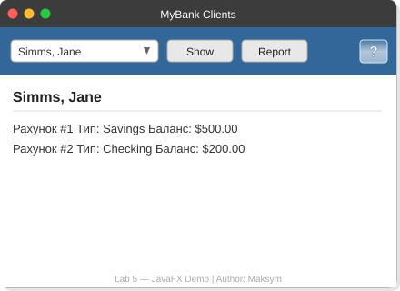

# Lab 5 — JavaFX GUI для банківської системи MyBank

**Автор:** Maksym  
**Курс:** Об'єктно-орієнтоване програмування (Java)  
**Тема:** Створення GUI за допомогою JavaFX

---

## Скріншот запущеної програми



---

## Опис проєкту

Проєкт демонструє створення графічного інтерфейсу за допомогою **JavaFX** для банківської системи **MyBank**.  
Базується на стартовому коді `FXDemo.java`, розширеному до рівня «на п'ять».

### Реалізовані функції

| Елемент | Опис |
|---|---|
| **ComboBox** | Список клієнтів банку (завантажуються з `test.dat`) |
| **Show** | Відображає **всі** рахунки обраного клієнта (тип + баланс) |
| **Report** | Загальний звіт по всіх клієнтах + підсумковий баланс |
| **?** | Діалог `Alert` з інформацією про програму |

---

## Структура проєкту

```
gui-3-Maksym860-master/
├── src/
│   └── com/mybank/gui/
│       └── FXDemo.java         ← головний JavaFX-клас
├── data/
│   └── test.dat                ← файл з даними клієнтів
├── jars/
│   └── MyBank.jar              ← бібліотека Bank, Customer, Account
├── Lab 5 - JavaFX/
│   ├── Lab 5.md                ← умова завдання
│   └── GUI-Lab-5.PNG           ← прототип інтерфейсу
├── screenshot.svg              ← знімок екрану запущеної програми
├── build.gradle
└── README.md
```

---

## Формат файлу `test.dat`

```
4                        ← кількість клієнтів

Jane    Simms    2       ← ім'я, прізвище, кількість рахунків
S  500.00  0.05          ← Savings: баланс, відсоткова ставка
C  200.00  400.00        ← Checking: баланс, ліміт овердрафту
...
```

- `S` — SavingsAccount (ощадний): баланс + відсоткова ставка  
- `C` — CheckingAccount (чековий): баланс + ліміт овердрафту

---

## Як запустити

### Варіант 1 — через NetBeans

1. `File` → `Open Project` → оберіть папку `gui-3-Maksym860-master`
2. `Properties` → `Libraries` → `Add JAR/Folder` → додайте `jars/MyBank.jar`
3. Також додайте **JavaFX SDK** як бібліотеку (якщо JDK < 11)
4. `Run Project` (F6)

### Варіант 2 — командний рядок (JDK 11+ з JavaFX)

```bash
# Компіляція
javac --module-path /path/to/javafx/lib --add-modules javafx.controls \
      -cp jars/MyBank.jar \
      src/com/mybank/gui/FXDemo.java -d out/

# Запуск (з кореня проєкту)
java --module-path /path/to/javafx/lib --add-modules javafx.controls \
     -cp "out/:jars/MyBank.jar" com.mybank.gui.FXDemo
```

> **Windows:** замініть `:` на `;` у classpath

---

## Виконані завдання

- ✅ **На «3»** — JavaFX-форма зі списком клієнтів, Show (перший рахунок), кнопка «?»
- ✅ **На «4»** — читання з `test.dat`, Show показує **всі** рахунки клієнта
- ✅ **На «5»** — кнопка **Report** з повним звітом і загальним балансом
